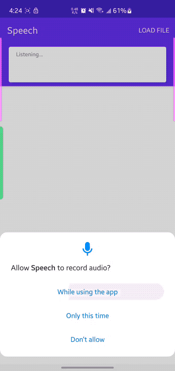

# google_cloud_speech_to_text_demo
This is a demo app for Google Cloud Speech to Text service

### Where does this repo come in?
When working on integrating Speech-to-Text feature for some app, I wanted to try out [Google Cloud Speech-to-Text](https://cloud.google.com/speech-to-text/?hl=en) service. After browsing the docs I didn't find any helpful info about how to apply it into an Android app (neither for an iOS app).

There is one archived sample at GitHub [GoogleCloudPlatform/android-docs-samples](https://github.com/GoogleCloudPlatform/android-docs-samples/tree/master/speech/Speech), but that one was built years ago, I ran into various errors when trying to build it up. 

After figuring out all of the errors, I'd like to share a ready-to-use demo app for it.

### How to use this repo?
1. First, you need to follow the instruction at [here](https://github.com/GoogleCloudPlatform/android-docs-samples/tree/master/speech/Speech#set-up-to-authenticate-with-your-projects-credentials), to enable the Speech-to-Text API for your Google Cloud account, after that you can get your own `credential.json`. This bro did great work at [here](https://youtu.be/gLFCrCBNC3A?t=84) for a step-by-step instruction video.
2. The `credential.json` is crucial for using this demo. When you get yours, checkout this repo, and put it at: `google_cloud_speech_to_text_demo/app/src/main/res/raw/credential.json` &lt;-- your goes here
3. Open this repo in your Android Studio, sync and run it. I had successfully run it on two versions: `Android Studio Electric Eel | 2022.1.1 Patch 2` and `Android Studio Hedgehog | 2023.1.1`

### What does it look like?

